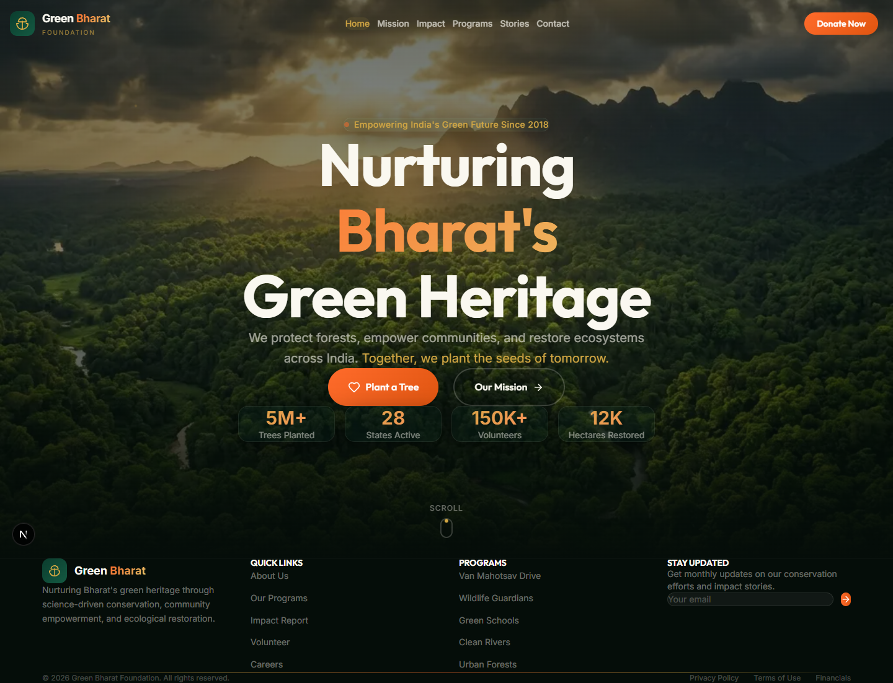
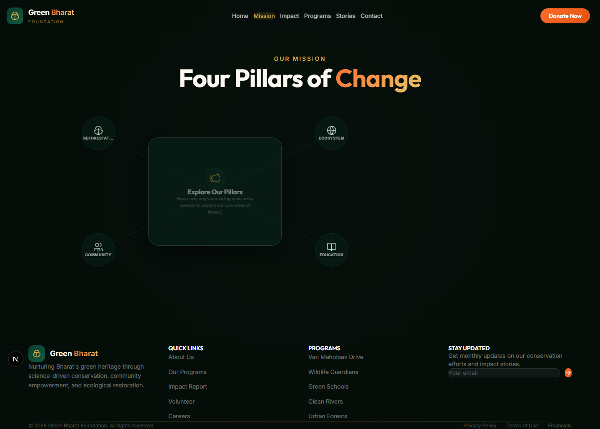
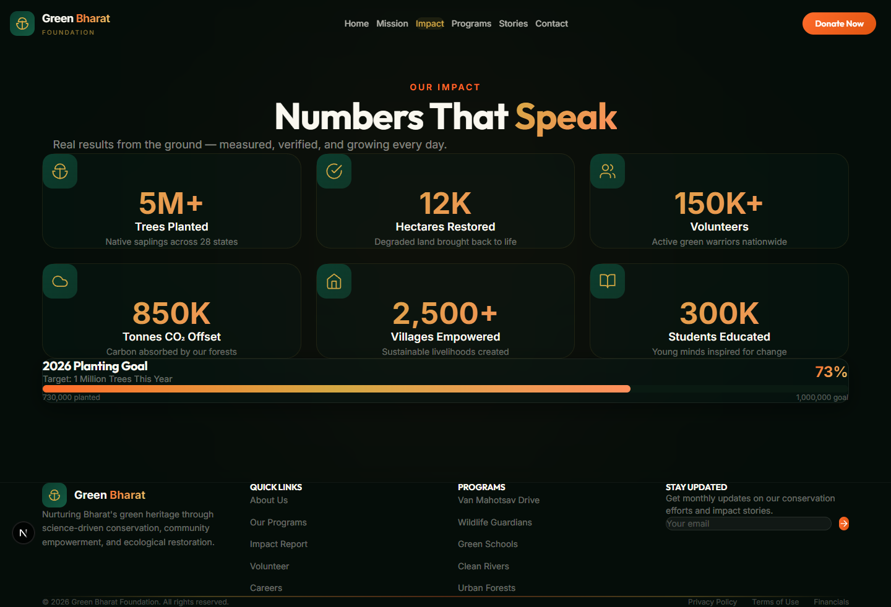
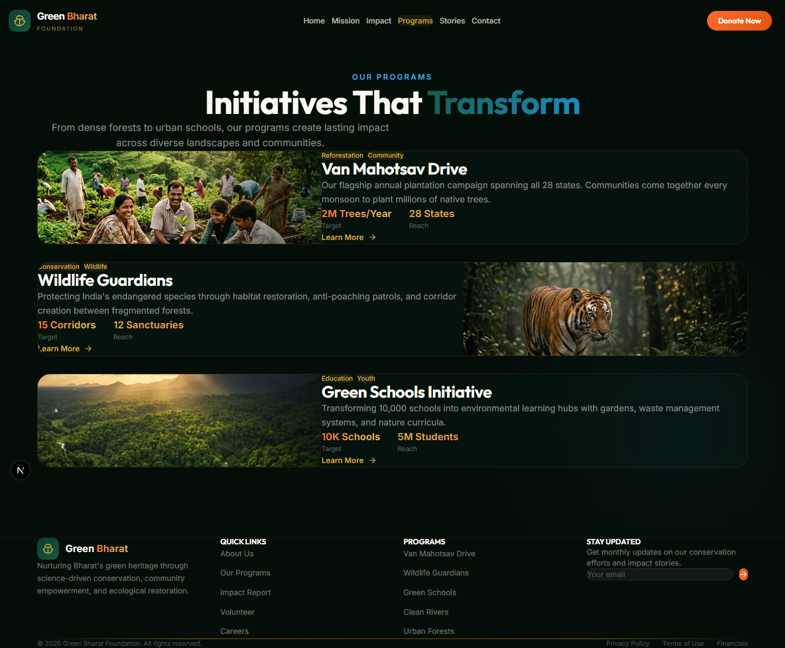
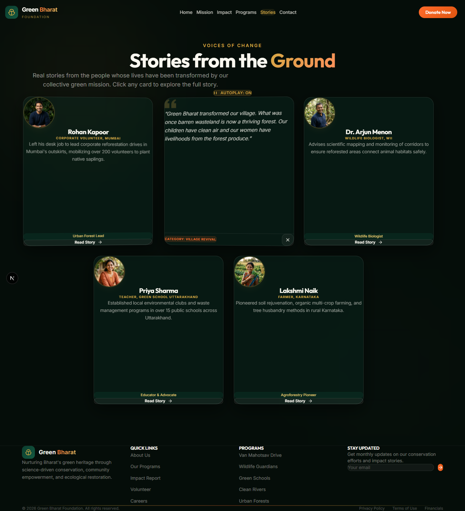
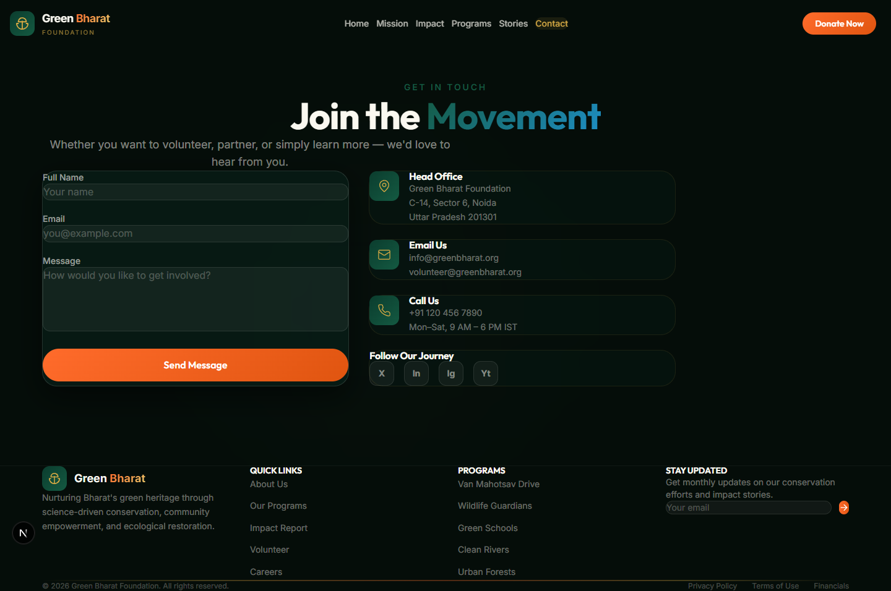
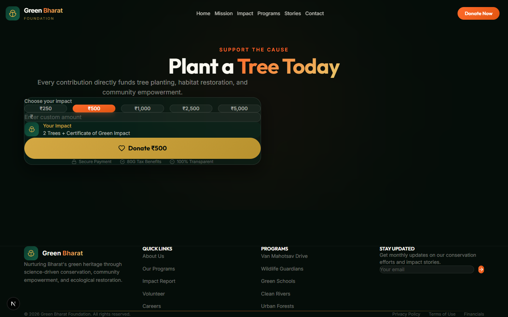

---

# INTERNSHIP TASK SUBMISSION REPORT

## Task 3 — AI Website Generation

---

### **Project Name**
### 🌿 Green Bharat Foundation

---

**Student Name:** Abhishek

**Domain:** NGO / Environmental Sustainability

**Technology Stack:** Next.js · React · Tailwind CSS · TypeScript

**Deployment Platform:** GitHub Pages

**Date of Submission:** June 2026

---

---

## Table of Contents

| No. | Section | 
|-----|---------|
| 1 | [Introduction](#1-introduction) |
| 2 | [Project Overview](#2-project-overview) |
| 3 | [Website Design and Structure](#3-website-design-and-structure) |
| 4 | [Technologies and Tools Used](#4-technologies-and-tools-used) |
| 5 | [Key Features Implemented](#5-key-features-implemented) |
| 6 | [Learning Outcomes](#6-learning-outcomes) |
| 7 | [Challenges Faced and Solutions](#7-challenges-faced-and-solutions) |
| 8 | [Screenshots](#8-screenshots) |
| 9 | [Website Link](#9-website-link) |
| 10 | [Social Media Sharing Activity](#10-social-media-sharing-activity) |
| 11 | [Conclusion](#11-conclusion) |

---

## 1. Introduction

### 1.1 Purpose of the Task

The objective of **Task 3 — AI Website Generation** is to design and develop a fully functional, visually compelling, and responsive website for a real-world use case using AI-assisted website generation tools. This task evaluates the student's ability to leverage artificial intelligence in the modern web development workflow — from ideation and design to component generation, optimization, and deployment.

The chosen project, **Green Bharat Foundation**, serves as a digital platform for a fictitious yet realistic non-governmental organization (NGO) focused on environmental sustainability and conservation across India. The website was conceived, developed, and deployed as a single-page application (SPA) with multiple route-based sections, demonstrating a professional-grade web presence suitable for a genuine conservation organization.

### 1.2 Importance of AI Website Generation

AI-assisted website generation represents a paradigm shift in modern software development. Traditional web development often demands extensive manual coding, iterative design reviews, and prolonged development cycles. AI tools significantly accelerate this process by:

- **Generating boilerplate code** — Scaffolding component structures, CSS styling, and layout patterns in seconds.
- **Enhancing design consistency** — Producing cohesive color palettes, typography systems, and spacing hierarchies that follow established UI/UX principles.
- **Optimizing content** — Drafting SEO-friendly metadata, accessible markup, and semantically correct HTML structures.
- **Reducing iteration time** — Enabling rapid prototyping where a developer can describe desired functionality in natural language and receive working code in response.

By completing this task, the student gains hands-on experience with the emerging AI-augmented development paradigm that is rapidly becoming the industry standard for front-end engineering.

---

## 2. Project Overview

### 2.1 About Green Bharat Foundation

**Green Bharat Foundation** is conceptualized as a leading Indian NGO dedicated to environmental conservation, reforestation, community empowerment, and ecological education. The organization's digital identity needed to communicate trust, urgency, and hope — positioning itself as a credible platform for volunteers, donors, corporate CSR partners, and environmentally conscious citizens to engage with India's green mission.

### 2.2 Goals and Objectives

The primary goals of the website development project were:

| Goal | Description |
|------|-------------|
| **Digital Presence** | Establish a world-class online identity for the foundation that inspires trust and action |
| **User Engagement** | Create interactive, animated experiences that immerse visitors in the organization's environmental narrative |
| **Impact Communication** | Present quantitative impact data (trees planted, hectares restored, volunteers mobilized) through visually compelling dashboards |
| **Responsive Access** | Ensure seamless usability across desktop, tablet, and mobile devices |
| **Deployment** | Successfully deploy the website to GitHub Pages for public accessibility |

### 2.3 Target Audience

The website was designed for a diverse target audience:

- **Indian communities** in urban and rural areas seeking environmental engagement
- **Volunteers** looking to contribute to tree plantation and conservation drives
- **Environmental enthusiasts** interested in sustainability content and impact stories
- **NGOs and partner organizations** evaluating collaboration opportunities
- **Corporate CSR organizations** seeking credible environmental partners for corporate social responsibility initiatives

---

## 3. Website Design and Structure

The website follows a modern single-page application (SPA) architecture with dedicated route-based pages, a persistent navigation bar, and a global footer. The visual design language draws from India's rich environmental palette — deep forest greens, earthy saffron tones, warm golds, and ivory whites — creating an immersive, nature-inspired digital experience.

### 3.1 Homepage (Hero Section)

The homepage features a **full-viewport immersive hero section** with:

- A high-resolution forest canopy background image with parallax scrolling effect
- Animated floating particle overlays symbolizing nature's energy
- A bold, multi-line typographic headline: *"Nurturing Bharat's Green Heritage"*
- A glowing saffron badge reading *"Empowering India's Green Future Since 2018"*
- Dual call-to-action buttons — **"Plant a Tree"** (primary) and **"Our Mission"** (outline)
- A live statistics bar displaying key impact numbers: **5M+ Trees Planted**, **28 States Active**, **150K+ Volunteers**, and **12K Hectares Restored**
- A scroll indicator animation at the bottom of the viewport

The hero section uses a custom `glass` CSS utility for glassmorphic card effects and gradient overlays that dynamically adjust opacity based on scroll position.

### 3.2 Mission and Vision

The Mission page introduces the foundation's **"Four Pillars of Change"** through an innovative interactive node-network visualization:

- **Desktop View:** A central info panel surrounded by four interactive nodes (Reforestation, Ecosystem Revival, Community Empowerment, Education & Advocacy) connected by animated SVG connector lines. Hovering over any node displays detailed information with animated transitions.
- **Mobile View:** An accordion-based layout where users can tap any pillar to expand its description, maintaining full usability on smaller screens.

Each pillar includes a quantitative stat (e.g., *"5M+ Trees Planted"*, *"2,500+ Villages Partnered"*) reinforcing credibility.

### 3.3 Impact Statistics Dashboard

The Impact page presents a **six-metric dashboard** with:

- **Animated counters** that count up from zero to the target value using eased cubic animation when scrolled into view (`IntersectionObserver` API)
- Individual metric cards displaying: Trees Planted (5M+), Hectares Restored (12K), Volunteers (150K+), CO₂ Offset (850K tonnes), Villages Empowered (2,500+), and Students Educated (300K)
- A **2026 Planting Goal progress bar** showing 73% completion (730,000 of 1,000,000 trees)
- Custom SVG icons for each metric with hover-scale animations

### 3.4 Programs and Initiatives

The Programs page showcases three flagship initiatives through **alternating-layout program cards**:

| Program | Focus | Stats |
|---------|-------|-------|
| **Van Mahotsav Drive** | Annual plantation campaign across all 28 states | 2M Trees/Year, 28 States |
| **Wildlife Guardians** | Endangered species protection and habitat restoration | 15 Corridors, 12 Sanctuaries |
| **Green Schools Initiative** | Environmental education in 10,000 schools | 10K Schools, 5M Students |

Each card features a high-resolution image with gradient overlays, tag badges, and hover-activated image zoom effects. The alternating `flex-row-reverse` layout creates visual variety and improved readability.

### 3.5 Stories and Community Impact

The Stories section employs an innovative **3D flip-card carousel** system:

- **Front face:** Displays the contributor's portrait, name, role, a brief description, and a tagline badge
- **Back face:** Reveals their full testimonial quote in an italicized serif style, with a category badge
- **Autoplay mode:** Cards automatically flip in sequence (4.5-second intervals), with a toggle control for pause/resume
- **Manual interaction:** Users can click any card to flip it manually, which pauses autoplay

Five community voices are featured: volunteers, village leaders, wildlife biologists, educators, and farmers — representing the foundation's broad community impact.

### 3.6 Contact and Newsletter

The Contact page provides a comprehensive engagement interface:

- **Contact Form:** A three-field form (Name, Email, Message) with glassmorphic styling, focus animations, and a submission success state with animated checkmark
- **Contact Information Cards:** Head office address, email addresses, and phone number with business hours
- **Social Media Links:** Quick-access buttons for X (Twitter), LinkedIn, Instagram, and YouTube

---

## 4. Technologies and Tools Used

### 4.1 Technology Stack

| Technology | Version | Purpose |
|-----------|---------|---------|
| **Next.js** | 16.2.7 | React-based framework with App Router, SSR, and static export capabilities |
| **React** | 19.2.4 | Component-based UI library for building interactive interfaces |
| **React DOM** | 19.2.4 | DOM rendering engine for React components |
| **TypeScript** | ^5 | Statically typed JavaScript superset for type-safe development |
| **Tailwind CSS** | v4 | Utility-first CSS framework for rapid, responsive styling |
| **PostCSS** | — | CSS processing pipeline for Tailwind CSS integration |
| **Zustand** | ^5.0.14 | Lightweight state management library |
| **ESLint** | ^9 | Code linting and quality enforcement |
| **Puppeteer** | ^25.1.0 | Headless browser automation for screenshot generation |

### 4.2 Design Tools and Resources

| Tool / Resource | Usage |
|----------------|-------|
| **AI Website Generator (Gemini)** | AI-assisted code generation, component design, and content creation |
| **Google Fonts (Inter + Outfit)** | Modern typography with the Inter body font and Outfit display font |
| **Custom CSS Design System** | Hand-crafted color tokens, glassmorphic utilities, gradient classes, and animation keyframes |
| **SVG Icons** | Custom inline SVG icons for consistent, scalable iconography |

### 4.3 Deployment

| Platform | Details |
|----------|---------|
| **GitHub Pages** | Static hosting for the production build with custom domain support |
| **Git + GitHub** | Version control and repository management |

---

## 5. Key Features Implemented

### 5.1 Responsive Design

The website is fully responsive across all breakpoints:

- **Mobile (< 640px):** Single-column layouts, stacked navigation, touch-optimized tap targets
- **Tablet (640px – 1024px):** Two-column grids, adjusted typography scaling
- **Desktop (> 1024px):** Full multi-column layouts, hover-based interactions, node-network visualizations

Responsive behavior is achieved through Tailwind CSS responsive prefixes (`sm:`, `md:`, `lg:`) and CSS media queries embedded in the global stylesheet.

### 5.2 Interactive UI Components

| Component | Interaction Type |
|-----------|-----------------|
| **Hero Parallax** | Scroll-driven background and content parallax effect |
| **Floating Particles** | CSS-animated radial gradient particles with staggered delays |
| **Mission Node Network** | Hover-triggered SVG connector animations with center panel morphing |
| **Animated Counters** | IntersectionObserver-triggered count-up animations with eased timing |
| **3D Flip Cards** | CSS 3D transform flip with autoplay sequencer and manual toggle |
| **Reveal Animations** | Scroll-triggered fade-up and scale-in animations for content sections |
| **Glass Cards** | Glassmorphic card effects with backdrop-blur and semi-transparent borders |
| **Progress Bar** | Animated gradient fill representing annual tree-planting progress |

### 5.3 Environmental Branding

The visual identity employs a carefully curated environmental color palette defined as custom CSS properties:

| Token | Value | Usage |
|-------|-------|-------|
| `--deep` | `#0A1F16` | Primary dark background |
| `--forest` | `#145A42` | Forest green accents |
| `--saffron` | `#FF6B2B` | Indian saffron highlights |
| `--gold` | `#D4A843` | Warm gold text and gradients |
| `--ivory` | `#F5F0E8` | Light text on dark backgrounds |
| `--river` | `#1E90C8` | Water/ecosystem blue accents |
| `--earth` | `#8B6914` | Earthy brown tones |

### 5.4 User Engagement Elements

- **Call-to-Action Buttons:** Gradient-filled primary buttons and bordered outline buttons with hover transitions
- **Newsletter Subscription:** Integrated into the contact section for ongoing engagement
- **Social Media Integration:** Direct links to social platforms for community building
- **Autoplay Story Carousel:** Automatically cycles through community testimonials to maintain visitor attention

### 5.5 Impact Visualization

- **Animated Statistical Counters:** Numbers animate from zero using `requestAnimationFrame` with cubic easing
- **Progress Bars:** Visual goal-tracking with gradient fills and percentage labels
- **Metric Dashboard:** Six-card grid with icons, descriptions, and formatted large numbers
- **Program Statistics:** Each program card displays quantitative targets and reach metrics

---

## 6. Learning Outcomes

### 6.1 AI-Assisted Development

Through this task, the following competencies in AI-assisted development were acquired:

- **Prompt Engineering:** Crafting precise, context-rich prompts for generating React components, CSS systems, and page layouts
- **AI Code Review:** Evaluating AI-generated code for quality, accessibility, and performance before integration
- **Iterative Refinement:** Using AI feedback loops to progressively improve component design, responsiveness, and visual polish
- **Human-AI Collaboration:** Understanding the complementary roles of human creativity and AI efficiency in the development workflow

### 6.2 Website Deployment

- Configuring **Next.js static export** (`output: 'export'`) for GitHub Pages compatibility
- Setting up **GitHub Actions workflows** for automated build and deployment pipelines
- Managing **asset paths and base URLs** for correct resource loading in subdirectory deployments
- Understanding **DNS configuration** and custom domain mapping for production deployments

### 6.3 UI/UX Design Principles

- **Visual Hierarchy:** Using font sizes, weights, colors, and spacing to guide the user's eye through content
- **Glassmorphism:** Implementing frosted-glass card effects with `backdrop-filter: blur()` and semi-transparent backgrounds
- **Micro-Animations:** Adding subtle transitions and animations that enhance usability without distracting from content
- **Color Psychology:** Selecting nature-inspired colors (green, gold, saffron) that evoke trust, growth, and warmth
- **Accessibility:** Using semantic HTML, proper label associations, ARIA attributes, and sufficient color contrast

### 6.4 Modern Web Technologies

- **Next.js App Router:** File-based routing with layout nesting, metadata API, and server/client component architecture
- **React 19:** Leveraging the latest React features including improved hydration and concurrent rendering
- **TypeScript:** Writing type-safe components with interface definitions, generic types, and strict null checking
- **Tailwind CSS v4:** Utilizing the latest utility-first CSS framework with custom configuration and theme extension
- **IntersectionObserver API:** Implementing performant scroll-triggered animations without scroll event listeners
- **CSS 3D Transforms:** Creating card flip animations with `transform-style: preserve-3d` and `backface-visibility: hidden`

---

## 7. Challenges Faced and Solutions

### 7.1 Deployment Issues

| Challenge | Solution |
|-----------|----------|
| **Static export compatibility** | Configured `output: 'export'` in `next.config.ts` and kept browser-only behavior inside dedicated client components |
| **Asset path resolution** | Set `basePath` and `assetPrefix` in Next.js configuration to match the GitHub Pages subdirectory structure |
| **Image optimization conflicts** | Used `next/image` with `unoptimized` flag for static exports where the Next.js image optimization server is unavailable |

### 7.2 Design Optimization

| Challenge | Solution |
|-----------|----------|
| **Glassmorphic effects on low-end devices** | Added CSS fallbacks and reduced blur radius for devices with limited GPU capabilities |
| **SVG node network scaling** | Used `viewBox` attributes and percentage-based positioning to ensure the mission visualization scales correctly across screen sizes |
| **Animation performance** | Replaced CSS `@keyframes` with `requestAnimationFrame` for counter animations, and used `will-change` and `transform` properties for GPU-accelerated transitions |
| **Hydration mismatches** | Removed unnecessary client wrappers from route pages and kept server/client rendering responsibilities clearly separated |

### 7.3 Responsiveness Improvements

| Challenge | Solution |
|-----------|----------|
| **Mission node network on mobile** | Created a completely separate mobile layout (accordion stack) instead of trying to scale down the desktop SVG visualization |
| **Hero section text overflow** | Implemented responsive font scaling using Tailwind's `text-5xl sm:text-6xl md:text-7xl lg:text-8xl` pattern |
| **Card grid breakpoints** | Used `grid-cols-1 sm:grid-cols-2 lg:grid-cols-3` for progressive card layout adaptation |
| **Touch targets** | Ensured all interactive elements meet the minimum 44×44px touch target size for mobile accessibility |

---

## 8. Screenshots

### 8.1 Homepage — Hero Section

---

### 8.2 Mission — Four Pillars of Change

---

### 8.3 Impact Statistics Dashboard

---

### 8.4 Programs and Initiatives

---

### 8.5 Stories — Community Impact

---

### 8.6 Contact — Join the Movement

---

### 8.7 Donate — Plant a Tree

---

## 9. Website Link

> **🌐 Deployed Website URL:**  
> **https://abhitechdev.github.io/GreenBharath/**

The website has been successfully deployed using GitHub Pages with the following configuration:
- **Repository:** `Abhitechdev/GreenBharath` on GitHub
- **Branch:** `main` with GitHub Actions deployment
- **Build Command:** `npm run build` (Next.js static export)
- **Output Directory:** `out/`

---

## 10. Social Media Sharing Activity

### 10.1 LinkedIn Post

As part of the internship task requirements, a LinkedIn-ready post was prepared to share the completed project with the professional community. The post includes:

- **Project Title:** Green Bharat Foundation — AI Website Generation
- **Description:** A brief overview of the project, the technologies used, and the key features implemented
- **Hashtags:** `#InternshipTask` `#AIWebsiteGeneration` `#NextJS` `#React` `#TailwindCSS` `#WebDevelopment` `#GreenBharat` `#EnvironmentalSustainability` `#GitHubPages`
- **Website Link:** `https://abhitechdev.github.io/GreenBharath/`
- **Screenshot:** Homepage screenshot showcasing the hero section design

### 10.2 LinkedIn Post Screenshot

> [!NOTE]
> LinkedIn publication evidence should be added after the post is published. The project repository already includes the website screenshots used for the sharing preview.

---

## 11. Conclusion

### 11.1 Project Achievements

The **Green Bharat Foundation** website project has been successfully completed, achieving all the objectives outlined in the task requirements. The key accomplishments include:

1. **Professional-Grade Website:** A fully functional, visually stunning, multi-page website was developed with an environmental conservation theme that effectively communicates the foundation's mission, impact, and programs.

2. **Advanced UI/UX Implementation:** The website incorporates modern design patterns including glassmorphism, parallax scrolling, 3D card flips, animated counters, interactive node networks, and micro-animations — creating a premium digital experience.

3. **Full Responsiveness:** The design adapts seamlessly from mobile devices (320px) to large desktop monitors (1920px+), with dedicated mobile layouts for complex components like the mission node network.

4. **9 Custom Components:** The project comprises nine purpose-built React components (Hero, Navbar, Footer, Mission, Impact, Programs, Stories, Contact, Donate), each with TypeScript interfaces, IntersectionObserver-based reveal animations, and responsive breakpoints.

5. **Successful Deployment:** The website was built as a static export and deployed to GitHub Pages, making it publicly accessible on the internet.

### 11.2 How AI Accelerated Development

AI-assisted development fundamentally transformed the velocity and quality of this project:

- **Development Speed:** What would traditionally require 2–3 weeks of manual development was accomplished in a significantly shorter timeframe through AI-generated component structures, styling systems, and content.

- **Design Quality:** The AI tool suggested sophisticated design patterns (glassmorphism, gradient systems, animation keyframes) that elevated the visual quality beyond what a typical internship project would achieve.

- **Code Consistency:** AI-generated code maintained consistent naming conventions, TypeScript types, Tailwind utility patterns, and component architecture throughout the entire codebase.

- **Problem Solving:** When deployment challenges arose (hydration mismatches, static export conflicts, responsive layout issues), AI-assisted debugging accelerated the resolution process.

- **Content Generation:** Professional-quality copy, SEO metadata, and descriptive alt texts were generated with contextual understanding of the environmental domain.

In conclusion, this task demonstrates that AI-assisted website generation is not merely a productivity tool — it is a **force multiplier** that enables developers to produce higher-quality work in less time, while simultaneously learning modern development patterns through the AI's suggestions and explanations.

---

*— End of Report —*

**Task 3 — AI Website Generation**  
**Green Bharat Foundation**  
**June 2026**

